# Secret Republic - Browser Based futuristic PHP hacker game - V3

<p align="center">


<a rel="license" href="http://creativecommons.org/licenses/by/4.0/"></a>

</p>

Live Demo: https://secretrepublic-v3.nenuadrian.com

Hosted on recommended provider [DreamHost](https://mbsy.co/dreamhost/92571715).

Audio Trailer: https://www.youtube.com/watch?v=6thfiGb-b7c

[Read about the journey of this project in this Medium article.](https://medium.com/@adrian.n/secret-republic-open-sourced-hacker-simulation-futuristic-rpg-browser-based-game-php-843d393cb9d7)

# Table of contents

1. [Overview](#Overview)

2. [Main features](#Main-Features)

3. [SecretAlpha v4](#SecretAlpha-V4)

4. [Simple Setup](#Simple-Setup)
   * Semi-manual setup
   * Manual setup
   * Useful tips

5. [Screenshots](#Screenshots)

6. Learning the platform

7. Framework details
   * ~MVC Architecture
   * Routing
   * Creating new missions
   * Adding skills, ablitites or tutorial steps
   * New pages with minimal functionality

8. [Tests](#Tests)

9. Sponsors and contributors

10. [License](#License)

# Overview

Built from the ground up by a fairely inexperienced software developer at the time.

It's been through years of development with this being its 3rd full do-over.

A PHP & MySQL based browser based, mobile compatible, role playing game. The theme is post-apocalyptic futuristic hacking.

There are many features, enough for this to be a stand-alone game, ranging from guilds/organizations, to party system, single and multi-player missions, servers players can build and hack, wars between zones players can join and even be the president of, forums and blogs. And that is not even all.

Documentation is minimal and is being built as we go.

I am trying to actively contribute and solve raised issues, so please feel free to raise one, and more so please contribute with whatever you can!

# Main-Features

| Feature       | Description           |
| ------------- | --------------------- |
| Futuristic UI | Bootstrap made. Custom build. Generally responsive. |
| Abilities     | Upgradeable, enhance player stats, take time to level up. Controlled by `constants/abilities.php`.     |
| Skills        | Point based, where points can be earned by levelling up. Enhance player stats. Controlled by `constants/skills.php`.  |
| Tutorial      | Multiple guiding steps, with rewards at each step. Players can skip steps. Quite advanced and flexible, easy to extend. Controlled by `constants/tutorial.php`. |
| Rewards       | The reward system allows the game to give players multiple rewards (stat points, money, etc.) in a packaged way (as a reward with multiple items). The players can then accept the reward at which point it will be applied, and they can review history of rewards. |
| Audio AI      | Audio cues have been pre-recorded for use in the game. They can be muted and play when specific actions take place. |
| Admin Panel   | Advanced administration interface, with user management, mission design screens, and more. |
| Mission Designer | Part of the admin panel, allows for advanced design of missions, with multiple objective and sub-objectives, and custom BBCodes. |
| Missions      | Enhanced UNIX terminal-like missions, which can be leveraged across the game, including for guild daily missions, the hackdown competition, training, or story-drive missions. Easy to extend and re-use. |
| Servers | Can build multiple, each with their own upgradable hardware (motherboard, ram, hdd, power source). And software which can be run and uses resources. |
| Forums | Feature-rich integrated forum system. With the ability to create internal forums specific to guilds in-game. |
| Organizations | Guild-like system. Owned by players. Can create multiple membership groups, there are missions specific for organizations and wars can be declared between them. They can have their own internal forums. |
| Messaging | Ability for players to chat, in a thread based system. |
| Blogs | Feature-rich player blog system. |
| Hackdown | Mission based `cron.php` scheduled competition. |
| Friends | Friend system for players. |
| The Grid |  Every players gets a starting `node` and can initialize/conquer other empty nodes or from other players. The world is split in multiple zones, which are divided into clusters with multiple nodes in each cluster. Damage and spy attacks can be triggered between nodes. There's an attempt at a simulator for attacks |
| Attacks | Players can launch attacks using their nodes on other players. |
| Data Points | Mined via `cron.php` and use resources and software. |
| Alpha Coins | Premium currency, with custom in-game shop, coupons and more. |
| Rankings | Generated via `cron.php`, they are at player and organization granularity. |
| Job | Give players a mission designed in the mission designer to complete depending on level, for rewards. |
| Zones | Splits the world, 6 zones, each with many clusters, each with a couple of nodes. Players can take over nodes, and they start with a random node. | 
| Train | Captcha and some other mini-games designed for players to complete daily for rewards. | 

# SecretAlpha-V4

V4 is newer, more responsive made with mobile-first in mind, but with way less features.

https://github.com/nenuadrian/Secret-Republic-Hacker-Game-ORPBG-Alpha

# Simple-Setup

## Require steps

You need a webserver (e.g. MAMP/WAMP/XAMPP) able to run PHP (tested with 7.3) and an MySQL database (LAMP stack).

1. Install `composer` (the PHP dependency management system - `brew install composer` for MacOS if you have brew) and run `composer install`

2. Create an empty Database in MySQL. For MAMP, you would go to `http://localhost:8888/phpMyAdmin5`

## Semi-manual setup

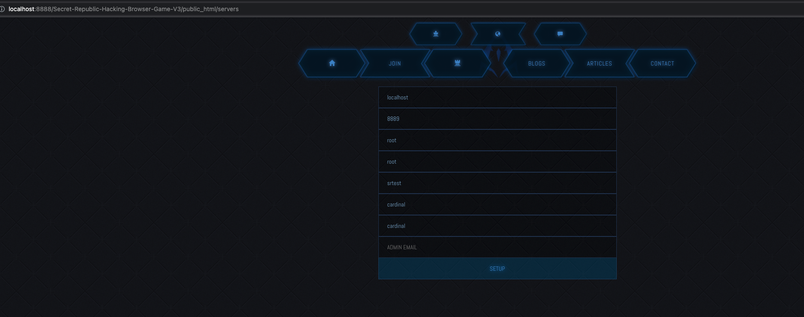

Visit `http://localhost/public_html/setup` - this may be different if you are using another port or directory structure, e.g. `http://localhost:8888/sr/public_html/setup` and follow the setup process

## Manual setup

1. Import `includes/install/DB.sql` to the database you have created.

2. Rename `includes/database_info.php.template` to `includes/database_info.php` and update the details within accordingly.

3. The game should be up and running. Go and create and account manually.

4. Go to the `user_credentials` table and update the entry for your user, setting the column `group_id` to be `1`. This will make your account a full administrator. Log out and log back in.

## Useful tips

You may need to manually execute the following SQL if you see a GROUP BY related error on the missions page:

```
SET GLOBAL sql_mode=(SELECT REPLACE(@@sql_mode,'ONLY_FULL_GROUP_BY',''));
```

# Cron jobs

https://en.wikipedia.org/wiki/Cron

These ensure processes run as required, that hacking competitions start, that attack reports are generated and that time based resources are given to players.

Set these up to run periodically as the parameters suggest. The resources one should run every minute.

| Name | Description | URL    | Proposed schedule |
| -----|-------------|-------|------- |
| Attacks | | localhost/cron/key1/MDMwN2Q3OGRiYmM4Y2RkOWZjNTBmMzA4MzViZDZiNjQ=/attacks/true | Every minute |
| Hourly | | localhost/cron/key1/MDMwN2Q3OGRiYmM4Y2RkOWZjNTBmMzA4MzViZDZiNjQ=/hourly/true | Hourly |
| Daily | | localhost/cron/key1/MDMwN2Q3OGRiYmM4Y2RkOWZjNTBmMzA4MzViZDZiNjQ=/daily/true | Daily |
| Hackdown | | localhost/cron/key1/MDMwN2Q3OGRiYmM4Y2RkOWZjNTBmMzA4MzViZDZiNjQ=/hackdown/true | Daily |
| Rankings | | localhost/cron/key1/MDMwN2Q3OGRiYmM4Y2RkOWZjNTBmMzA4MzViZDZiNjQ/rankings/true | Hourly |
 

Example:
```
*/2 * * * * wget -O - http://localhost/cron/key1/MDMwN2Q3OGRiYmM4Y2RkOWZjNTBmMzA4MzViZDZiNjQ=/attacks/true >/dev/null 2>&1
```

Or use the control panel your host may provide.

# Screenshots

## main page
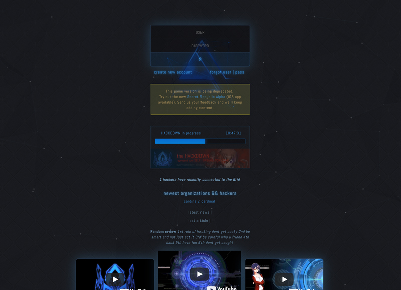

## player dashboard
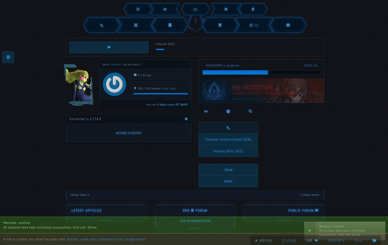

## mission
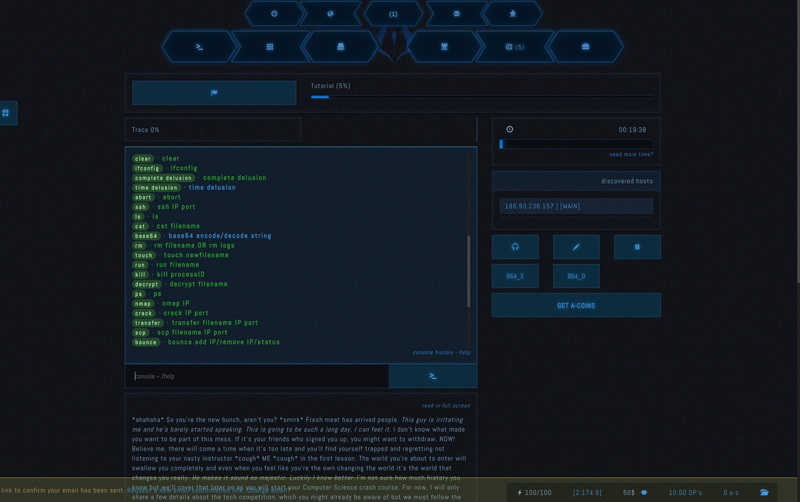

## organization
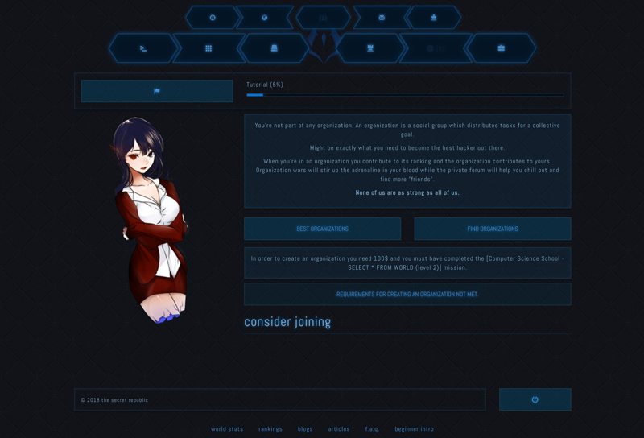

## skills
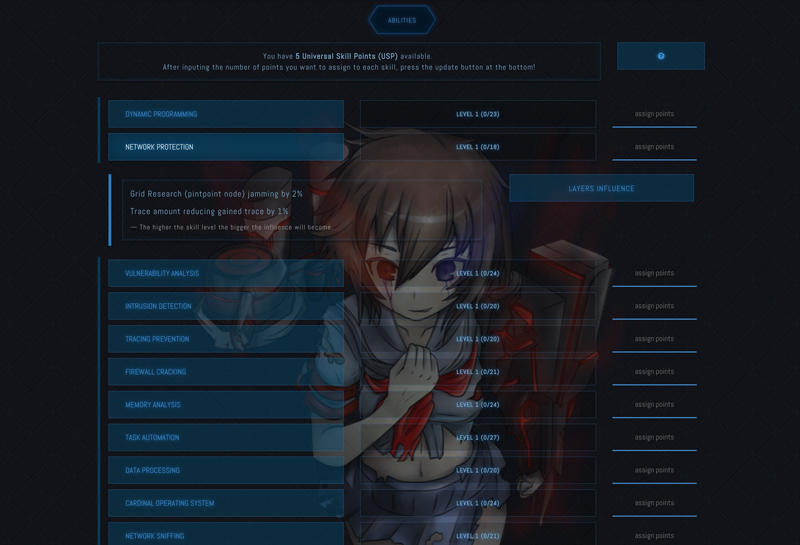

## the grid


## mission designer
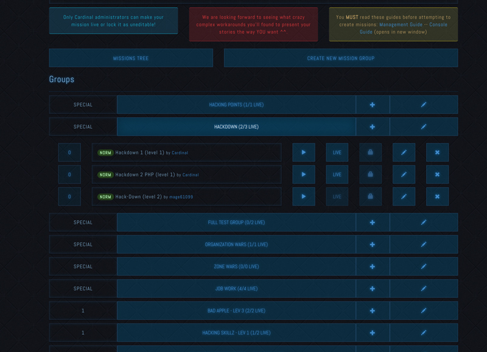

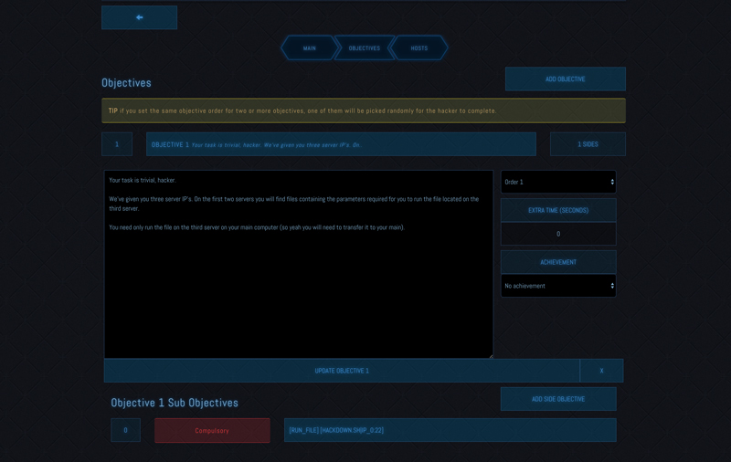

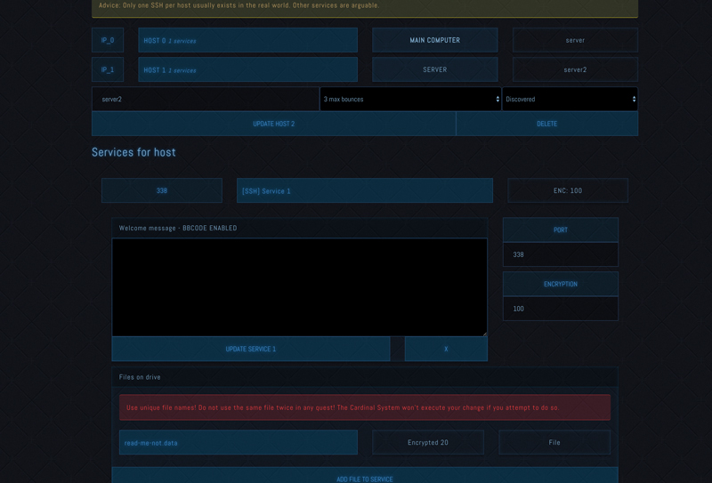

## forum
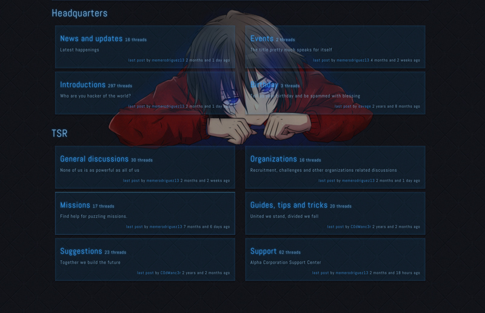

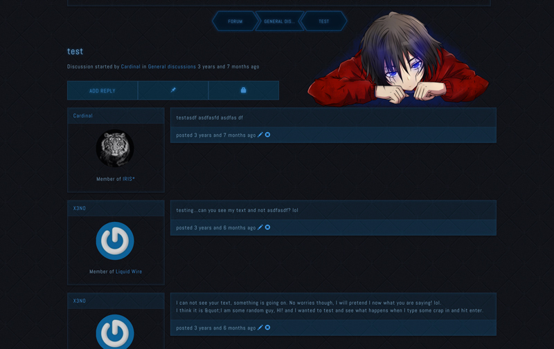


# Framework details

Sadly it was built from scratch, combining vanilla PHP, the Smarty template engine and a few libraries (composer.json). It makes use of Smarty caching.

Lint:
```
./includes/vendor/bin/phplint --exclude=vendor  --no-cache -v
```

## ~MVC Architecture

TBC

## Routing

Is done based on the `includes/modules` folder. Adding a new module file say helloworld.php, will allow `http://localhost/helloworld` to work. 

Something such as `http://localhost/helloworld/hacker/test` will pass the value test in `$GET["hacker"]`.

Any variables `http://localhost/helloworld/hi?attach=2` would be passed in `$GET["attack"]`.

This all happens in `public_html/index.php`.

## Creating new missions

Please refer to the the GUIDES folder in this repository. In contains instructions of what can be used within the Mission descriptions to benefit from dynamic IP generation between missions and other useful instructions, tips and tricks.

## Adding skills, ablitites or tutorial steps

Check the `includes/constants` folder.

### Tutorial steps

Modify `includes/constants/tutorial.php`.

When adding or modifying a step also check if you need to add or modify a `tutorial_step_N_check` function in the same file, where N is the number of the step you have added or modified within `tutorial.php`.

## New pages with minimal functionality

This is as simple as create a `.tpl` file in `templates/pages`.

The easiest starting point is creating a copy of the `template.tpl` file which is within the same directory.

As soon as it is created, the page will be available at `/pages/NAME` e.g. `http://localhost/pages/template`.

# Tests

```
./includes/vendor/phpunit/phpunit/phpunit tests
```

# Sponsors and contributors

## Contributors

If your pull request is merged, I will add your name here. Thank you for your contribution!

   * [nenuadrian](https://github.com/nenuadrian) - main developer
   * [SKSaki](https://github.com/SKSaki) - initial user and bug-finder

## Sponsors

Thank you all who bought credits when the game was active. Your name will appear here if you financially contribute to the open-source project. Get in touch to do so.

# License

This initial version was created by [Adrian Nenu] (https://github.com/nenuadrian) 

<a rel="license" href="http://creativecommons.org/licenses/by/4.0/"></a>

Please link and contribute back to this repository if using the code or assets :)
